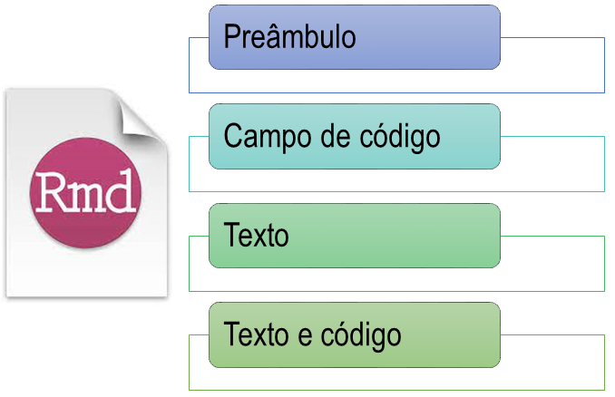

# Motivação

- Primeiro contato

.pull-left[
```{r,echo=FALSE, fig.align='left', out.width='100%'}
knitr::include_graphics('figuras_ufla/minicurso.png')
```
]

.pull-right[
```{r,echo=FALSE, fig.align='left', out.width='75%'}

```
]

<br>
<br>

--

- Alternativa

```{r,echo=FALSE, fig.align='center', out.width='15%'}
knitr::include_graphics('https://media.giphy.com/media/SA5uw3Td33qF4FGIlY/giphy.gif')
```

---

# RMarkdown

.pull-left[
Códigos e saídas `R`

```{r,echo=FALSE, fig.align='center', out.width='50%'}
knitr::include_graphics('figuras_ufla/r.jpg')
```
]


.pull-right[
`Markdown` (Gruber e Swartz, 2004) 

```{r,echo=FALSE, fig.align='center', out.width='50%'}
knitr::include_graphics('figuras_ufla/mark.png')
```
]

<br>

--

```{r,echo=FALSE, fig.align='center', out.width='25%'}
knitr::include_graphics('figuras_ufla/rmarkdown.png')
```

---

# RMarkdown

&#10004; Processo de "transformação"

```{r,echo=FALSE, fig.align='center', out.width='75%'}

```
<p style="text-align:center;">R Markdown from Rstudio</p>

<br>
<br>

--

&#10004; Renderizar o arquivo `R Markdown`

Barra de ferramentas: &nbsp; 

---

# Referências

```{r, echo = FALSE, fig.align='center', out.width='50%'}

```

<br>

- [knitr](https://yihui.org/knitr/)

- [RMarkdown from Rstudio](https://rmarkdown.rstudio.com/)

---

# Pacotes

.pull-left[
```{r,echo=FALSE, fig.align='left', out.width='75%'}

```
]

.pull-right[
&#10004;`rmarkdown`

<br>
 
&#10004; `knitr`

<br>

&#10004; `tinytex`

<br>
 
&#10004; `xtable` 
]

---

# Estrutura do arquivo `R Markdown`

```{r, echo=FALSE, fig.align='center', out.width='75%'}

```

---

# Preâmbulo

.pull-left[
```yaml
---
title: "Título"
author: "Nome"
date: "data"
output: html_document
---
```
]

.pull-right[
```{r, echo=FALSE, fig.align='center', out.width='30%'}
knitr::include_graphics('figuras_ufla/html.png')
```
]

--

.pull-left[
```yaml
---
title: "Título"
author: "Nome"
date: "data"
output: pdf_document
---
```
]

.pull-right[
```{r, echo=FALSE, fig.align='center', out.width='30%'}

```
]

---

# Preâmbulo

.pull-left[
```yaml
---
title: "Título"
author: "Nome"
date: "data"
output: word_document
---
```
]

.pull-right[
```{r, echo=FALSE, fig.align='center', out.width='30%'}

```
]

---

# Texto

.pull-left[
**Sintaxe**

```markdown
 *itálico* 
```
]

.pull-right[
**Resultado**

*itálico*
]

--

.pull-left[
```markdown
 **negrito** 
```
]

.pull-right[
**negrito**
]

--

.pull-left[
```markdown
 **_negrito e itálico_** 
```
]

.pull-right[
**_itálico e negrito_**
]

.pull-left[
Expressão matemática

<code>$\sum\limits_{i=1}^{n}x_i$</code>
]

.pull-right[
 $\sum\limits_{i=1}^{n}x_i$ 
]

**Observação**: `$$` no lugar `$` centraliza a expressão matemática

******

Símbolo latex: [https://www.caam.rice.edu/~heinken/latex/symbols.pdf](https://www.caam.rice.edu/~heinken/latex/symbols.pdf)

---

.pull-left[
**Sintaxe**

Link
```markdown
[link](https://rmarkdown.rstudio.com)
```
]

**Resultado**

.pull-right[
[link](https://rmarkdown.rstudio.com)
]

--

.pull-left[
Comentário

```markdown
<!-- Texto -->
```
]

.pull-right[
<!-- Texto -->
]

--

.pull-left[
Lista

```markdown
* item 1
* item 2
  + sub-item 1
  + sub-item 2
```
]

.pull-right[
* item 1
* item 2
  + sub-item 1
  + sub-item 2
]

--

.pull-left[
```markdown
1. ordered list
2. item 2
   + sub-item 1
   + sub-item 2 
```
]

.pull-right[
1. ordered list
2. item 2
   + sub-item 1
   + sub-item 2 
]

---

.pull-left[
**Sintaxe**
```markdown
 # Seção
 ## Sub-seção
 ### sub-sub-seção
```
]

.pull-right[
**Resultado**
# Seção
## Sub-seção
### Sub-sub-seção
]

---

# Código de campo (code chunk)

Atalho: **Ctrl + Alt + I**

Barra de ferramentas: &nbsp; 

--

````markdown
`r ''````{r}

```
````

--

&#128187; **Global**

````markdown
`r ''````{r setup, include=FALSE}
knitr::opts_chunk$set(echo = TRUE)
```
````

--

&#128187; **Local**

````markdown
`r ''````{r, echo = TRUE}

```
````

---

## Opções de chunk

&#10004; `echo`: mostrar ou não o código em `R`

.pull-left[
````markdown
`r ''````{r, echo = TRUE}
data(cars)
head(cars, n=4)
```
````
]

.pull-right[
```{r, echo = TRUE}
data(cars)
head(cars, n=4)
```
]

--

.pull-left[
````markdown
`r ''````{r, echo = FALSE}
data(cars)
head(cars, n=4)
```
````
]

.pull-right[
```{r, echo = FALSE}
data(cars)
head(cars, n=4)
```
]

---

&#10004; `comment`: remove os &sharp; &sharp;

.pull-left[
````markdown
`r ''````{r}
data(cars)
head(cars, n=4)
```
````
]

.pull-right[
```{r}
data(cars)
head(cars, n=4)
```
]

--

.pull-left[
````markdown
`r ''````{r, comment = ''}
data(cars)
head(cars, n=4)
```
````
]

.pull-right[
```{r, comment = ''}
data(cars)
head(cars, n=4)
```
]

---

&#10004; `message`: remover mensagens geradas pelos códigos 

.pull-left[
````markdown
`r ''````{r}
library(tidyverse)
```
````
]

.pull-right[
```{r}
library(tidyverse)
```
]

--

.pull-left[
````markdown
`r ''````{r, message = FALSE}
library(tidyverse)
```
````
]

.pull-right[
```{r, message = FALSE}
library(tidyverse)
```
]

---

&#10004; `warning`: remover os avisos de *warnings* gerados pelo código  

.pull-left[
````markdown
`r ''````{r}
library(pracma)
```
````
]

.pull-right[
```{r}
library(pracma)
```
]

--

.pull-left[
````markdown
`r ''````{r, warning = FALSE}
library(pracma)
```
````
]

.pull-right[
```{r, warning = FALSE}
library(pracma)
```
]

---

&#10004; `eval`: executar ou não o código em `R`

.pull-left[
````markdown
`r ''````{r}
lm(dist~speed, data=cars)
```
````
]

.pull-right[
```{r}
lm(dist~speed, data=cars)
```
]

--

.pull-left[
````markdown
`r ''````{r, eval = FALSE}
lm(dist~speed, data=cars)
```
````
]

.pull-right[
```{r, eval = FALSE}
lm(dist~speed, data=cars)
```
]

---

&#10004; `results = 'hide'`: executar e não mostra a saída em `R`

.pull-left[
````markdown
`r ''````{r}
lm(dist~speed, data=cars)
```
````
]

.pull-right[
```{r}
lm(dist~speed, data=cars)
```
]

--

.pull-left[
````markdown
`r ''````{r, results = 'hide'}
lm(dist~speed, data=cars)
```
````
]

.pull-right[
```{r, results = 'hide'}
lm(dist~speed, data=cars)
```
]

*****

[Guia de referências](https://www.rstudio.com/wp-content/uploads/2015/03/rmarkdown-reference.pdf)

---

# Texto e código

**Exemplo de frase**:

Se o raio de um círculo é igual a 3, então a área do círculo
é &apos;r round(pi*(3^2),4)&apos;

<br>

**Resultado**

Ee o raio de um círculo é igual a 3, então a área do círculo é `r round(pi*(3^2),4)`

---

# Tabela

Personalizar saída de tabelas:

- `digits`: número de casas decimais

--

- `caption`: título

--

- `col.names`: nome das colunas

--

- `align`: alinhamento das colunas

<br>

&#10004; Código para fazer as tabelas

````markdown
`r ''````{r}
kable()
xtable()
```
````

---

# Informações em *data frame*

```{r}
library(knitr)

kable(head(cars))
```

---

# Resultados de funções em `R`

```{r}
library(knitr)
library(xtable)

fit <- lm(dist~speed, data=cars)

tab1 <- xtable(fit)
kable(tab1)
```

---

# Figura

Personalizar saída de figuras:

- `fig.caption`: título

--

- `fig.align`: alinhamento

--

- `fig.width`: largura em polegadas

--

- `fig.height`: altura em polegadas

--

- `out.width = " "`: largura em porcentagem

<br>

&#10004; Código para fazer os gráficos

````markdown
`r ''````{r}
plot()
```
````

---

## Gráfico

````markdown
`r ''````{r, fig.caption = 'Gráfico de dispersão', 
fig.align = 'center',fig.height = 5, fig.width=6}
plot(cars$speed,cars$dist)
```
````

```{r, echo = FALSE, fig.cap='Gráfico de dispersão', fig.align='center', fig.height=5, fig.width=5}
plot(cars$speed,cars$dist)
```

---

&#10004; Para inserir figuras

````markdown
`r ''````{r}
include_graphics('')
```
````

## Imagem

** Pequeno** 

````markdown
`r ''````{r, fig.caption = 'Logo', fig.align = 'center',
out.width = '10%'}
library(knitr)

```
````

```{r , echo=FALSE, fig.caption = 'Logo', fig.align = 'center', out.width = '10%'}
library(knitr)

```

---

**Médio** 

````markdown
`r ''````{r, fig.caption = 'Logo', fig.align = 'center',
out.width = '50%'}
library(knitr)

```
````

```{r , echo=FALSE, fig.caption = 'Logo', fig.align = 'center', out.width = '50%'}
library(knitr)

```

---

# Tentativa e erro

```{r,echo=FALSE, fig.align='center', out.width='50%'}

```

Primeiros arquivos `R Markdown`

---

# Exercício

.pull-left[
```{r,echo=FALSE, fig.align='center', out.width='60%'}
knitr::include_graphics('https://media.giphy.com/media/heIX5HfWgEYlW/giphy.gif')
```
]

.pull-right[
Reproduzir a análise de um delineamento inteiramente casualizado em pdf ou html
]

O arquivo da análise está disponível no [google drive](https://drive.google.com/drive/folders/1HIPgbLBXJ00ZTQdZ_ZbIM_4nCtd3Mvym?usp=sharing)

